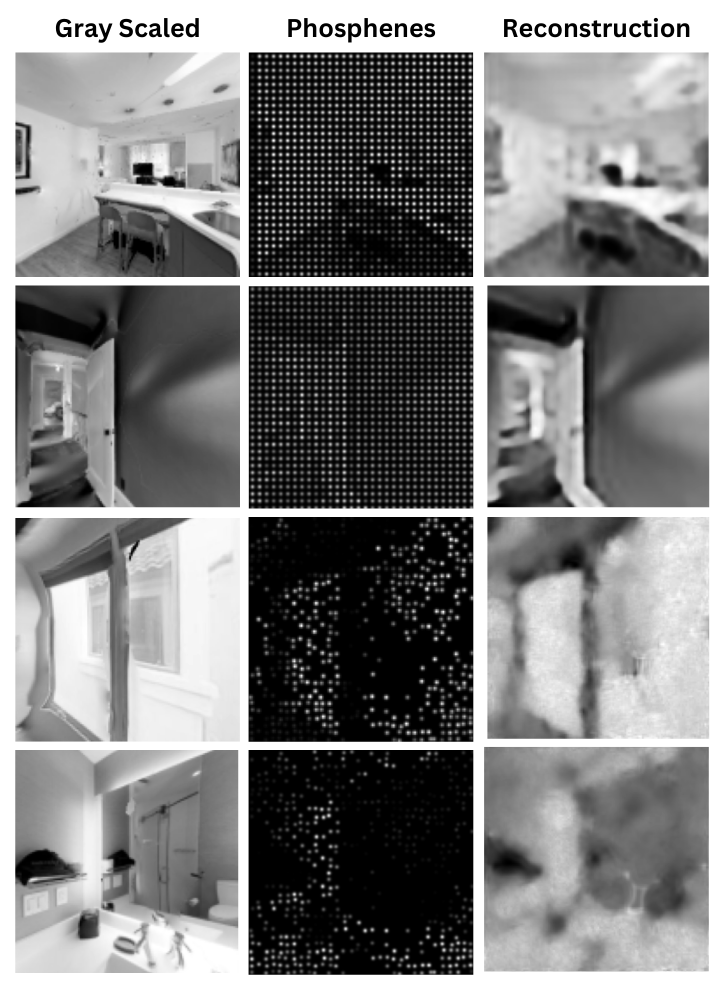

# Benchmark for Simulated Prosthetic Vision (SPV) with Habitat-AI (Meta)

This repository contains research-oriented code for training and evaluating embodied navigation agents under **Simulated Prosthetic Vision (SPV)** using Habitat-AI. Design for benchmarking different image transformations algorithms.

The project integrates:

- A modified version of **Habitat-Lab** (Meta)
- A custom SPV simulation module (`habitat-phosphenes/`)

---

## Project Scope

This is a **research-focused codebase**, not a library.

Full reproduction requires:
- Installing Habitat-Lab and its simulator dependencies
- Matching compatible Python/CUDA/PyTorch versions and supporting libraries (gym, atari, pytorch, pygame)
- Aligning with the version of Habitat used during development. Habitat-Lab (v2.4), Habitat-Sim (v0.2.3)

Habitat is version-sensitive and actively maintained upstream, so setup may require debugging and heavy adaptation if using newer releases.

---

## Key Contributions (My Work)

### 1. Simulated Prosthetic Vision (SPV) Pipeline
Implemented in `habitat-phosphenes/`:
- Implementation of different algorithms for feature extraction, segmentation, and encoding of visual information from scene observations.
- Incorporation of End-to-End pipeline for evaluation of SPV into Habitat-AI, based on Ruyter van Steveninck et al. (2022) and Küçükoglu et al. (2022).

Main file:
- `habitat-phosphenes/phosphenes.py`

---

### 2. E2E Integration in Habitat-Lab v2.4
Modifications to Habitat-Lab to:
- Accept SPV observations
- Integrate custom transforms
- Include reconstruction loss in training loop
- Modify reward computation pipeline

See:
- `CHANGES_HABITAT_LAB.md`

---

### 3. Experiment & Evaluation Tooling

Located in `habitat-phosphenes/`:

- `test.py` – main script used to start simulations (loads config files)
- `evaluate_scene.py` – evaluation script
- `interactive_demo.py` – interactive simulation demo
- `config_files_simulations/` – experiment configurations
- `plot_simulations_metrics*.py` – metrics visualization
- `extract_TB_data.py` – TensorBoard data extraction
- `ttestFromTimeSeries.py` – statistical comparison utilities

---

## Method Overview

High-level pipeline:

1. RGB observation from Gibson scenes in Habitat environments
2. SPV transform → phosphene-like representation
3. Agent accesses SPV input and updates its navigation policy
4. Reconstruction network attempts to reconstruct original image
5. Reconstruction loss integrated into PPO training

This enables studying navigation performance under simulated prosthetic vision constraints.

---

## Example Results

### Prosthetic Vision Reconstruction

---

### Navigation under SPV

---

## Repository Structure

- `habitat-phosphenes/` – SPV simulation, transforms, reconstruction models, evaluation, plotting
- `habitat-lab/` – Modified Habitat-Lab (includes upstream code + SPV integration changes)
- `CHANGES_HABITAT_LAB.md` – Summary of Habitat modifications

---

## Reproducibility Notes

- Habitat installation can be complex and version-dependent.
- The code was validated against the dependency stack available at the time of development.
- Compatibility with newer Habitat versions may require adaptation.

---

## References

- de Ruyter van Steveninck, J., Güçlü, U., vanWezel, R., & van Gerven,M. (2022). End-to-end optimization of prosthetic vision. Journal of Vision, 22(2), 20. https://doi.org/10.1167/jov.22.2.20
- Küçüko˘glu, B., Rueckauer, B., Ahmad, N., de Ruyter van Steveninck, J., Güçlü, U., & van Gerven,M. (2022). Optimization of neuroprosthetic vision via end-to-end deep reinforcement learning. International Journal of Neural Systems. https://doi.org/10.1142/s0129065722500526

---

## License

Please refer to:
- Habitat-Lab license in `habitat-lab/`
- 
